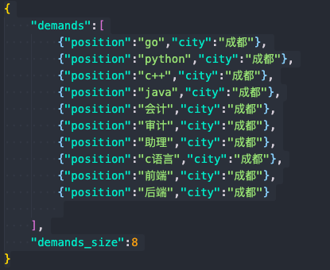

# 拉勾网爬虫
这是一个基于splash和asyncio的异步爬虫

## 比较
1. 一开始使用的是selenium和requests，爬取效率优先
2. 使用splash和aiohttp效率提升一倍

## 使用到的主要库
1. asyncio
2. aiohttp
3. concurrent.futures.ThreadPoolExecutor
4. colorama
5. docker + splash(非必须，使用同步就不需要)
6. selenium (同步爬取所使用)

## 入口
asyncSplashParse.py

syncParse_csv.py

## 使用
直接设置Demands.json配置需要的职位，结果会保存入results文件夹




然后运行你需要的爬取方式

```shell
python3 -u asyncSplashParse.py
```

